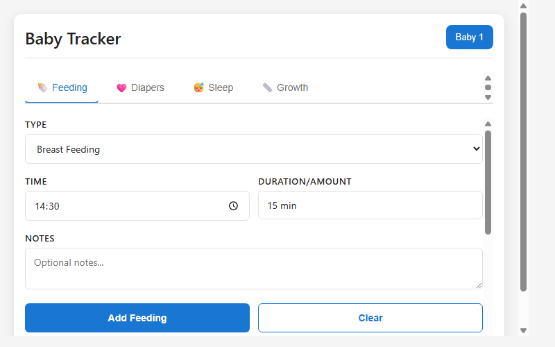
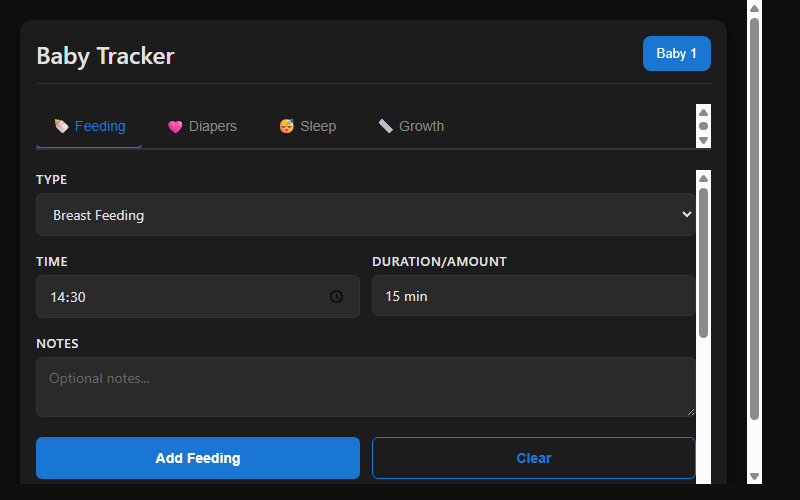

# Home Assistant Baby Tracker

[](https://github.com/MacSiem/ha-baby-tracker/actions/workflows/validate.yml)
[](https://github.com/hacs/integration)

A Lovelace card for Home Assistant that helps you track and monitor your baby's daily activities including feeding, diaper changes, sleep, and growth measurements all from your dashboard.



## Features

- Track multiple babies with dedicated tabs per baby
- **Feeding Log**: Record breast feeding, bottle feeding, and solid food with duration/amount and notes
- **Diaper Tracker**: Log wet and dirty diapers with daily counts and notes
- **Sleep Monitor**: Built-in timer for sleep sessions or manual entry of sleep duration with date tracking
- **Growth Chart**: Record weight, height, and head circumference with visual chart display
- Daily statistics and summaries
- Recent activity lists with timestamps
- Data export to JSON for backup or sharing
- Light and dark theme support

## Installation

### HACS (Recommended)

1. Open HACS in your Home Assistant
2. Go to Frontend → Explore & Download Repositories
3. Search for "Baby Tracker"
4. Click Download

### Manual

1. Download `ha-baby-tracker.js` from the [latest release](https://github.com/MacSiem/ha-baby-tracker/releases/latest)
2. Copy it to `/config/www/ha-baby-tracker.js`
3. Add the resource in Settings → Dashboards → Resources:
   - URL: `/local/ha-baby-tracker.js`
   - Type: JavaScript Module

## Usage

Add the card to your dashboard:

```yaml
type: custom:ha-baby-tracker
title: Baby Tracker
babies:
  - name: Baby 1
```

### Configuration

| Option | Type | Default | Description |
|--------|------|---------|-------------|
| `title` | string | `Baby Tracker` | Card title |
| `babies` | array | `[{name: 'Baby 1'}]` | List of babies to track. Each baby object has a `name` property |

## Screenshots

| Light Theme | Dark Theme |
|:-----------:|:----------:|
|  |  |

## How It Works

The card provides an intuitive interface for tracking baby care activities:

- **Feeding Tab**: Select feeding type, set time and duration/amount, add optional notes. View recent feedings with a scrollable list.
- **Diaper Tab**: Log diaper changes with type (wet, dirty, or both), time, and notes. See daily counts of wet and dirty diapers.
- **Sleep Tab**: Use the built-in timer to track sleep duration, or manually log sleep with date. View total sleep time for today and sleep history.
- **Growth Tab**: Record measurements (weight, height, head circumference) with dates. Visual chart shows growth trends over time.

All data is stored within the card and can be exported as JSON for backup purposes.

## License

MIT License - see [LICENSE](LICENSE) file.
