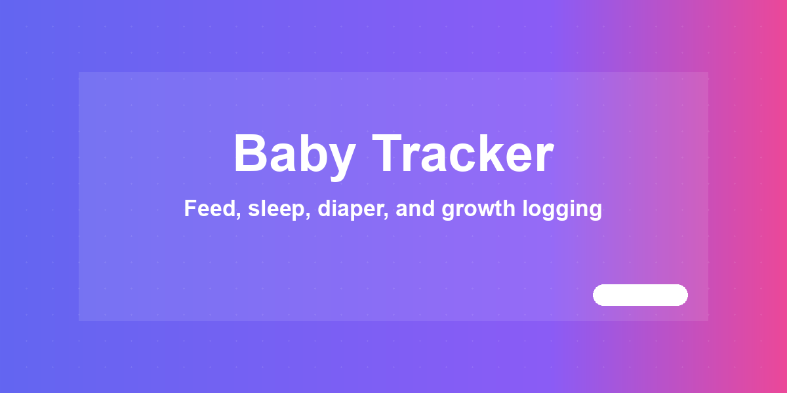
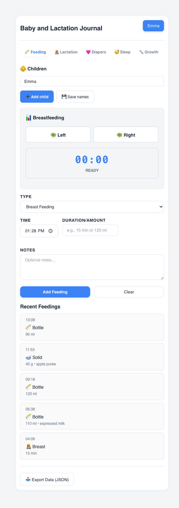
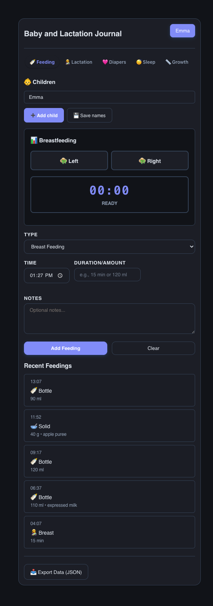

# Baby & Lactation Tracker



Track feedings, lactation, diapers, sleep, and growth for each child in Home Assistant.

[](https://www.home-assistant.io/) [](LICENSE) [](https://github.com/MacSiem/ha-baby-tracker/releases)

Part of the [HA Tools](https://github.com/MacSiem) ecosystem.

## How it works

**Short version: install the integration, add the card, log entries.**

1. **Server-side storage per child.** Each child is a config entry and device;
   entries (feeding, lactation, diapers, sleep, growth) are stored in Home
   Assistant's Store on the server — shared across every browser and user.
2. **The card is bundled.** The integration serves and registers the card JS
   automatically; you only add `custom:ha-baby-tracker` to a dashboard.
3. **Sensors update automatically.** Logging an entry (from the card, a
   service call, or Assist) updates the per-child sensors, so automations can
   react to feedings, diapers and sleep.

### What is automatic vs. manual

| Automatic | Manual |
|---|---|
| Card JS registration (no resource entry) | Creating one config entry per child |
| Per-child sensors from logged entries | Logging entries (card / service / Assist) |
| Sleep & breastfeeding timers state | Starting/stopping timers |
| Migration prompt from v4 localStorage | Confirming the migration |

## Screenshots

| Light | Dark |
|---|---|
|  |  |

*The Feeding tab: breastfeeding timer, quick entry form and recent feedings.
Dark mode follows your Home Assistant theme automatically.*

## What changed in v5

Baby & Lactation Tracker is now a Home Assistant integration with server-side storage. The Lovelace card is still bundled, but it is served by the integration and automatically registered as a frontend resource.

Legacy no-backend mode is preserved: if the integration is not configured, the card continues to use browser localStorage.

## Installation

### HACS custom repository

1. Open HACS -> Integrations -> menu -> Custom repositories.
2. Add `https://github.com/MacSiem/ha-baby-tracker` with category `Integration`.
3. Install **Baby & Lactation Tracker**.
4. Restart Home Assistant.
5. Go to Settings -> Devices & services -> Add integration -> **Baby Tracker**.
6. Create one integration entry per child. The child name is required; date of birth is optional.

Each child becomes a separate Home Assistant config entry and device.

### Lovelace card

After the integration is loaded, the card JS is registered automatically. Add the card manually:

```yaml
type: custom:ha-baby-tracker
```

No Lovelace resource entry is required in integration mode.

## Entities

Each child device exposes:

| Entity | Type | Description |
|---|---|---|
| `sensor.<child>_last_feeding` | timestamp | Last feeding entry time |
| `sensor.<child>_last_diaper` | timestamp | Last diaper entry time |
| `sensor.<child>_feedings_today` | number | Feedings counted for the current local day |
| `sensor.<child>_diapers_today` | number | Diapers counted for the current local day |
| `binary_sensor.<child>_sleeping` | binary sensor | On when the sleep timer is running |

Sensors are computed from the integration Store on startup; they do not depend on `RestoreEntity`.

## Services

Services can target a child by exact `child` name or by the child device target.

### Log feeding

```yaml
service: ha_baby_tracker.log_feeding
data:
  child: "Baby 1"
  type: bottle
  amount: "120 ml"
  time: "07:30"
  notes: "Morning bottle"
```

`type` can be `breast`, `bottle`, or `solid`. `time` accepts `HH:MM` or an ISO datetime and defaults to now.

### Log diaper

```yaml
service: ha_baby_tracker.log_diaper
data:
  child: "Baby 1"
  type: both
  notes: "After nap"
```

`type` can be `wet`, `dirty`, or `both`.

### Log sleep

Start and stop the timer:

```yaml
service: ha_baby_tracker.log_sleep
data:
  child: "Baby 1"
  action: start
```

```yaml
service: ha_baby_tracker.log_sleep
data:
  child: "Baby 1"
  action: stop
```

Or log an explicit interval:

```yaml
service: ha_baby_tracker.log_sleep
data:
  child: "Baby 1"
  start: "2026-06-12T20:00:00"
  end: "2026-06-12T21:15:00"
```

## Automation examples

```yaml
alias: Baby bottle button
trigger:
  - platform: state
    entity_id: input_button.baby_bottle
action:
  - service: ha_baby_tracker.log_feeding
    data:
      child: "Baby 1"
      type: bottle
      amount: "120 ml"
```

```yaml
alias: Night sleep started
trigger:
  - platform: time
    at: "20:00:00"
action:
  - service: ha_baby_tracker.log_sleep
    data:
      child: "Baby 1"
      action: start
```

## Assist examples

You can wire custom sentences or Assist automations to the services:

```yaml
intent_script:
  LogBabyBottle:
    action:
      - service: ha_baby_tracker.log_feeding
        data:
          child: "Baby 1"
          type: bottle
          amount: "{{ amount }} ml"
    speech:
      text: "Bottle logged."
```

```yaml
intent_script:
  LogBabyDiaper:
    action:
      - service: ha_baby_tracker.log_diaper
        data:
          child: "Baby 1"
          type: "{{ diaper_type }}"
    speech:
      text: "Diaper logged."
```

## Migration from v4 localStorage

When the v5 card detects the integration backend and finds old browser localStorage data, it prompts once to migrate matching children. Matching is by exact child name. Unmatched children are reported and left in browser storage.

The migration is idempotent: Store categories that already contain data are skipped instead of overwritten.

Keep an exported JSON backup before migrating if the data matters to you.

## Storage and privacy

- Data is stored in Home Assistant's server-side Store per child config entry.
- Removing a child config entry removes that child's Store file.
- The bundled card still has localStorage fallback when the backend is absent.
- No telemetry, analytics, CDN-hosted scripts, or external network calls are used.
- WHO growth percentile calculations and charts remain client-side in the card.

## FAQ

**Do all family members see the same data?**
Yes — since v5 entries live in Home Assistant's server-side Store, not in the
browser. Non-admin users can log and edit entries too (v5.0.7+).

**Can I use the card without the integration?**
Yes, legacy mode still works: without the backend the card falls back to
browser localStorage (per browser, per device — not shared).

**How do I track more than one child?**
Add one integration entry per child. The card gets a child switcher
automatically.

**Does this send data anywhere?**
No. Everything stays inside your Home Assistant instance — no telemetry,
no CDN assets. WHO growth percentiles are computed client-side.

## Changelog

See [CHANGELOG.md](CHANGELOG.md).

## Support

If this tool makes your Home Assistant life easier, consider supporting development:

- [Buy Me a Coffee](https://buymeacoffee.com/macsiem)
- [PayPal](https://www.paypal.com/donate/?hosted_button_id=Y967H4PLRBN8W)

## License

MIT - see [LICENSE](LICENSE).
