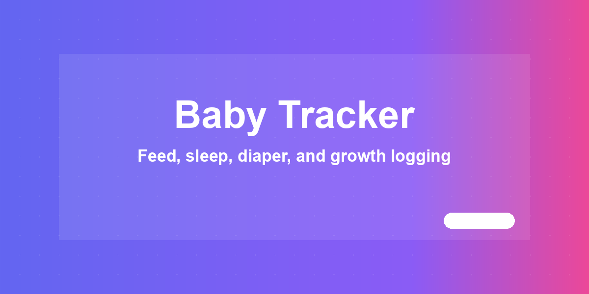
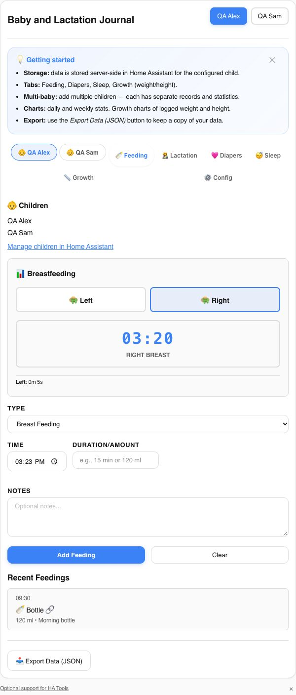
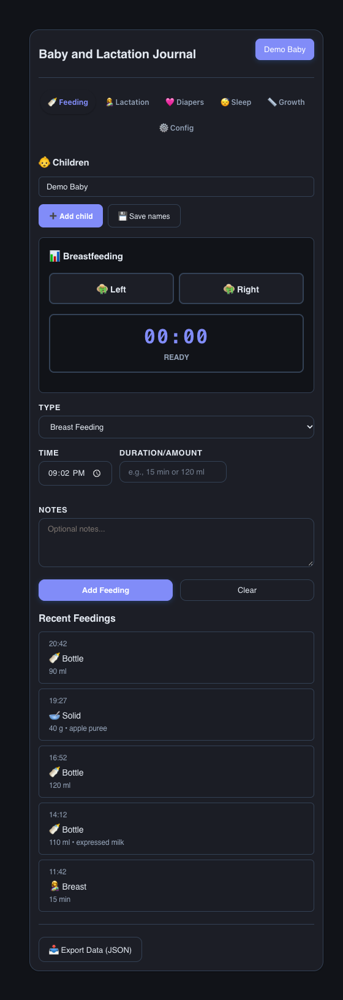

# Baby & Lactation Tracker



Track feedings, lactation, diapers, sleep, and growth for each child in Home Assistant.

[](https://www.home-assistant.io/) [](LICENSE) [](https://github.com/MacSiem/ha-baby-tracker/releases)

Part of the [HA Tools](https://github.com/MacSiem) ecosystem.

## How it works

**Short version: install the integration, add the card, log entries.**

1. **Server-side storage per child.** Each child is a config entry and device;
   entries (feeding, lactation, diapers, sleep, growth) are stored in Home
   Assistant's Store on the server — shared across every browser and user.
2. **The card is bundled.** The integration serves and registers the card JS
   automatically; you only add `custom:ha-baby-tracker` to a dashboard.
3. **Sensors update automatically.** Logging an entry (from the card, a
   service call, or Assist) updates the per-child sensors, so automations can
   react to feedings, diapers and sleep.

### What is automatic vs. manual

| Automatic | Manual |
|---|---|
| Card JS registration (no resource entry) | Creating one config entry per child |
| Per-child sensors from logged entries | Logging entries (card / service / Assist) |
| Sleep & breastfeeding timers state | Starting/stopping timers |
| Migration prompt from v4 localStorage | Confirming the migration |

## Screenshots

| Light | Dark |
|---|---|
|  |  |

*The Feeding tab on installed Home Assistant with synthetic QA Alex and QA Sam profiles: breastfeeding timer, quick
entry form and recent feedings. No household data appears in these images.
Dark mode follows your Home Assistant theme automatically.*

## What changed in v5

Baby & Lactation Tracker is now a Home Assistant integration with server-side storage. The Lovelace card is still bundled, but it is served by the integration and automatically registered as a frontend resource.

Legacy no-backend mode is preserved: if the integration is not configured, the card continues to use browser localStorage.

## Installation

### HACS custom repository

1. Open HACS -> Integrations -> menu -> Custom repositories.
2. Add `https://github.com/MacSiem/ha-baby-tracker` with category `Integration`.
3. Install **Baby & Lactation Tracker**.
4. Restart Home Assistant.
5. Go to Settings -> Devices & services -> Add integration -> **Baby Tracker**.
6. Create one integration entry per child. The child name is required; date of birth is optional.

Each child becomes a separate Home Assistant config entry and device.
When the integration is connected, use **Manage children in Home Assistant**
to add, rename or remove configured children. The browser-only child editor
is available only in legacy mode.
The sidebar panel is off by default. To show it to administrators, open any
Baby Tracker entry's **Configure** options and enable **Show administrator-only
sidebar panel**. It stays visible while at least one child entry enables it.

### Lovelace card

After the integration is loaded, the card JS is registered automatically. Add the card manually:

If this browser tab was already open when you added the first child, reload the page once before opening the card. Home Assistant may still have the earlier resource list in memory. No manual resource URL is needed.

```yaml
type: custom:ha-baby-tracker
```

In storage-mode dashboards, the integration maintains one Lovelace resource
for all child entries and respects an existing HACS resource. YAML mode uses
Home Assistant's frontend fallback. No manual resource entry is required.

## Entities

Each child device exposes:

| Entity | Type | Description |
|---|---|---|
| `sensor.<child>_last_feeding` | timestamp | Last feeding entry time |
| `sensor.<child>_last_diaper` | timestamp | Last diaper entry time |
| `sensor.<child>_feedings_today` | number | Feedings counted for the current local day |
| `sensor.<child>_diapers_today` | number | Diapers counted for the current local day |
| `binary_sensor.<child>_sleeping` | binary sensor | On when the sleep timer is running |

Sensors are computed from the integration Store on startup; they do not depend on `RestoreEntity`.

## Services

Services can target a child by exact `child` name, by the child's config
`entry_id`, or by the child device target (`device_id`). `entry_id` is the
config entry id shown in the URL when you open the child's entry in
**Settings → Devices & Services**; it is stable even if you rename the child.
If exactly one child is configured, all targeting fields can be omitted.

### Log feeding

```yaml
service: ha_baby_tracker.log_feeding
data:
  child: "Baby 1"
  type: bottle
  amount: "120 ml"
  time: "07:30"
  notes: "Morning bottle"
```

`type` can be `breast`, `bottle`, or `solid`. `time` accepts `HH:MM` or an ISO datetime and defaults to now.

An optional `side` field (`left`, `right`, or `both`) records which breast was
used — handy for `breast` feedings:

```yaml
service: ha_baby_tracker.log_feeding
data:
  child: "Baby 1"
  type: breast
  side: left
```

### Log diaper

```yaml
service: ha_baby_tracker.log_diaper
data:
  child: "Baby 1"
  type: both
  notes: "After nap"
```

`type` can be `wet`, `dirty`, or `both`.

### Log sleep

Start and stop the timer:

```yaml
service: ha_baby_tracker.log_sleep
data:
  child: "Baby 1"
  action: start
```

```yaml
service: ha_baby_tracker.log_sleep
data:
  child: "Baby 1"
  action: stop
```

Or log an explicit interval:

```yaml
service: ha_baby_tracker.log_sleep
data:
  child: "Baby 1"
  start: "2026-06-12T20:00:00"
  end: "2026-06-12T21:15:00"
```

## Automation examples

```yaml
alias: Baby bottle button
trigger:
  - platform: state
    entity_id: input_button.baby_bottle
action:
  - service: ha_baby_tracker.log_feeding
    data:
      child: "Baby 1"
      type: bottle
      amount: "120 ml"
```

```yaml
alias: Night sleep started
trigger:
  - platform: time
    at: "20:00:00"
action:
  - service: ha_baby_tracker.log_sleep
    data:
      child: "Baby 1"
      action: start
```

## Assist examples

You can wire custom sentences or Assist automations to the services:

```yaml
intent_script:
  LogBabyBottle:
    action:
      - service: ha_baby_tracker.log_feeding
        data:
          child: "Baby 1"
          type: bottle
          amount: "{{ amount }} ml"
    speech:
      text: "Bottle logged."
```

```yaml
intent_script:
  LogBabyDiaper:
    action:
      - service: ha_baby_tracker.log_diaper
        data:
          child: "Baby 1"
          type: "{{ diaper_type }}"
    speech:
      text: "Diaper logged."
```

## Migration from v4 localStorage

When the v5 card detects the integration backend and finds old browser localStorage data, it previews the number of records and running timers before asking for confirmation. Matching uses exact, unique child names. If two local children share a name or two integration entries have the same title, those children are skipped and reported as ambiguous so their records cannot be merged into the wrong child. Unmatched data remains in browser storage.

The migration is idempotent: Store categories that already contain data are skipped instead of overwritten, including when new data arrives between preview and commit. Partial migrations remain retryable after the ambiguous names are resolved. The card does not delete the old localStorage records.

Keep an exported JSON backup before migrating if the data matters to you.
JSON backups include lactation, breastfeeding sessions and running timers.
When connected to the integration, `children` contains every configured child's
records and timers, identified by entry ID so duplicate names remain separate.
`legacy_storage` preserves this card's local child records as their original JSON
strings, including children not currently displayed. A failed server read cancels
the download instead of saving an incomplete backup.

## Storage and privacy

- Data is stored in Home Assistant's server-side Store per child config entry, including when children share a display name.
- The card clears a form only after the server confirms the save. On an error, keep the form open, check the connection and retry; server mode does not make an extra browser backup.
- Linked feeding/lactation records are saved together. A failed timer stop keeps the timer visible so it can be retried.
- Storage writes are atomic and the files use Home Assistant's private Store option. The integration reads the saved state back before reporting success.
- Every authenticated household account can read and modify every configured child through the integration commands. The optional administrator-only sidebar does not restrict access to child data.
- Removing a child config entry removes that child's Store file.
- The bundled card still has localStorage fallback when the backend is absent. Users sharing the same browser profile and Home Assistant origin also share that local data.
- The integration does not send child records to an external service and uses no telemetry, analytics or CDN-hosted scripts. Its commands communicate with your Home Assistant instance.
- JSON export saves a plaintext backup to the location you choose in your browser. Protect that file as you would other household data. The optional support link opens an external website only when clicked and does not include child records.
- Home Assistant entities, automation consumers, logs and backups remain subject to your Home Assistant configuration and access permissions.
- Growth charts are rendered client-side in the card from your logged measurements.

## FAQ

**Do all family members see the same data?**
Yes — since v5 entries live in Home Assistant's server-side Store, not in the
browser. Non-admin users can log and edit entries too (v5.0.7+).

**Can I use the card without the integration?**
Yes, legacy mode still works: without the backend the card falls back to
browser localStorage (per browser, per device — not shared).

**How do I track more than one child?**
Add one integration entry per child. The card gets a child switcher
automatically.

**Does this send data anywhere?**
The integration does not automatically send child records to external services.
Records stay in Home Assistant or, in legacy mode, this browser's local storage.
An explicit JSON export creates a plaintext file at your chosen download location;
the optional support link opens an external website. Growth charts are drawn
client-side from your logged entries, without telemetry or CDN assets.

## Changelog

See [CHANGELOG.md](CHANGELOG.md).

## Support

If this tool makes your Home Assistant life easier, consider supporting development:

- [Buy Me a Coffee](https://buymeacoffee.com/macsiem)
- [PayPal](https://www.paypal.com/donate/?hosted_button_id=Y967H4PLRBN8W)

The card shows a small support link to administrators. It can be dismissed in the browser or hidden with `show_support: false` in the card configuration.

## License

MIT - see [LICENSE](LICENSE).

### Record command identifiers

Authenticated `ha_baby_tracker/update_entry` and `ha_baby_tracker/delete_entry` commands use `record_id` for the stored record's identifier, alongside `entry_id` and `category`. Home Assistant supplies the numeric request `id`; callers must not replace it with a record identifier. Updates also carry an `entry` patch.
